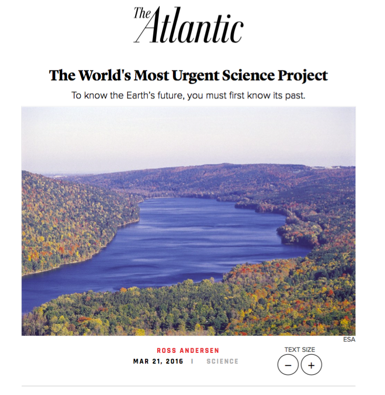
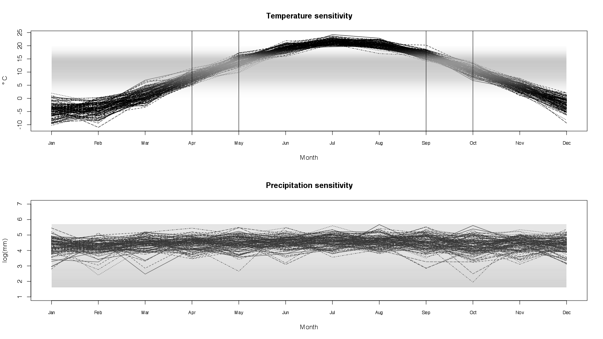

\definecolor{tangerine}{RGB}{0.95, 0.52, 0.0}

<style>
.newspaper {
    -webkit-column-count: 2; /* Chrome, Safari, Opera */
    -moz-column-count: 2; /* Firefox */
    column-count: 2;
    -webkit-column-gap: 0px; /* Chrome, Safari, Opera */
    -moz-column-gap: 0px; /* Firefox */
    column-gap: 0px;}
</style>


<!-- Things to add -->
<!-- MVGP paper ideas -->
<!-- Add citations -->

```{r setup, include=FALSE}
library(ggplot2)
library(here)
library(knitr)
# library(BayesComposition)
library(fields)
library(animation)
library(gganimate)
library(gplots)
source(here("functions", "multiplot.R"))
knitr::opts_chunk$set(echo = FALSE, 
                      fig.align="center",
                      out.width = "85%", 
                      fig.width = 16,
                      fig.height = 9)
## Option to change R code output font size
def.chunk.hook  <- knitr::knit_hooks$get("chunk")
knitr::knit_hooks$set(chunk = function(x, options) {
  x <- def.chunk.hook(x, options)
  ifelse(options$size != "normalsize", paste0("\\", options$size,"\n\n", x, "\n\n \\normalsize"), x)
})
```

```{r, echo=FALSE, message=FALSE}
biblio <- bibtex::read.bib("ksu.bib")
# biblio <- bibtex::read.bib(here("2018", "ksu", "KSU", "ksu.bib"))
```

# University of Arkansas Geosciences Colloquia

## Statistical Modeling

* Drawing conclusions based on data while accounting for random variation including sampling and observational errors.

<hr style="height:8px; visibility:hidden;" />

* Goal: Make **inference** about the state of the world using data.

<hr style="height:8px; visibility:hidden;" />

* Most statisitics is taught as a recipe. 

<hr style="height:8px; visibility:hidden;" />

* If your data are X then do Y.

<hr style="height:8px; visibility:hidden;" />

* Where is the creativity? Science?

##

```{r}
knitr::include_graphics(here("images", "Decision-tree_1.jpg"))
```

##

```{r}
knitr::include_graphics(here("images", "parametric-vs-non-parametric-test-hierarchy.jpg"))
```

## Problem

* Where is the science?

<hr style="height:8px; visibility:hidden;" />

* Don't we know something about the world other than our data is X?

<hr style="height:8px; visibility:hidden;" />

* How do we add this knowledge into our modeling?

<hr style="height:8px; visibility:hidden;" />


## Scientifically Motivated Statistical Modeling

* Probability model.

    * Model encodes our understanding of the scientific process of interest.
    
    * Model accounts for as much uncertainty as possible.
    
    * Model results in a probability distribution.

<hr style="height:8px; visibility:hidden;" />

* Update model with data.

    * Use the model to generate parameter estimates given data.

<hr style="height:8px; visibility:hidden;" />

## Scientifically Motivated Statistical Modeling

* Criticize the model

    * Does the model fit the data well?
    
    * Do the predictions make sense?
    
    * Are there subsets of the data that don't fit the model well?

<hr style="height:8px; visibility:hidden;" />    

* Make inference using the model.

    * If the model fits the data, use the model fit for prediction or inference.


## Probability Distributions

* Start with probability distributions:
    
    * Data $\mathbf{y}$.
    
    <hr style="height:8px; visibility:hidden;" />
    
    * Parameters $\boldsymbol{\theta}$.

    <hr style="height:8px; visibility:hidden;" />

    * $[\mathbf{y}]$ is the probability distribution of $\mathbf{y}$.

    <hr style="height:8px; visibility:hidden;" />

    * $[\mathbf{y} | \boldsymbol{\theta}]$ is the conditional probability distribution of $\mathbf{y}$ given parameters $\boldsymbol{\theta}$.
    
## Example: linear regression

$$
\begin{align*}
\left[y_i | \boldsymbol{\theta} \right] & \sim \operatorname{N}(X_i \beta, \sigma^2) \\
\boldsymbol{\theta} & = (\beta, \sigma^2)
\end{align*}
$$

<!--  -->

<!-- ```{r, out.width = "60%"} -->
<!-- # knitr::include_graphics(here("images", "linear-regression.gif")) -->
<!-- knitr::include_graphics(here("images", "GLM_normal_identity.png")) -->
<!-- ``` -->


```{r, out.width="80%"}
## Sample data
set.seed(0)
dat <- data.frame(x=(x=runif(200, 0, 50)),
                  y=rnorm(200, 10 * x, 100))

## breaks: where you want to compute densities
breaks <- seq(0, max(dat$x), len=7)[-c(1, 7)]
dat$section <- cut(dat$x, breaks)

## Get the residuals
dat$res <- residuals(lm(y ~ x, data=dat))

## Compute densities for each section, and flip the axes, and add means of sections
## Note: the densities need to be scaled in relation to the section size (2000 here)
ys <- seq(-300, 300, length = 50)
xs <- rep(breaks, each = 50) + 1000 * dnorm(ys, 0, 100)
res <- matrix(0, 50, 5)
for (i in 1:5) {
  res[, i] <- 10 * breaks[i] + ys 
}
dens <- data.frame(x = xs, y=c(res), 
                   grouping = cut(xs, breaks))
ggplot(dat, aes(x, y)) +
  geom_point(size = 2) +
  geom_smooth(method="lm", fill=NA, lwd=2, se = FALSE) +
  geom_path(data=dens, aes(x, y, group = grouping), 
            color="salmon", lwd=2) +
  theme_bw() +
  geom_vline(xintercept=breaks, lty=2)

```
  


## Model Framework

* Hierarchical model:

    * A model built in components.
    
    * Each component represents a different statistical goal.

<hr style="height:8px; visibility:hidden;" />

* Break the model into components:

    * <span style="color: #ff0000"> Data Model. </span>

    * <span style="color: #0000ff"> Process Model. </span>

    * <span style="color: #ff7f00"> Prior Model. </span> 

<hr style="height:8px; visibility:hidden;" />

* Combined, the <span style="color: #ff0000"> data model, </span> the <span style="color: #0000ff"> process model, </span> and the <span style="color: #ff7f00"> prior model </span> define a <span style="color: #00ffff"> posterior distribution. </span> 

# Data Model


$$
{\huge
\begin{align*}
[\mathbf{z}, \boldsymbol{\theta}_D, \boldsymbol{\theta}_P | \mathbf{y}] & \propto
\color{red}{[\mathbf{y} | \boldsymbol{\theta}_D, \mathbf{z}]}  [\mathbf{z} | \boldsymbol{\theta}_P] [\boldsymbol{\theta}_D] [\boldsymbol{\theta}_P]
\end{align*}
}%
$$


## Data model

$$
{\huge
\begin{align*}
\color{red}{[\mathbf{y} | \boldsymbol{\theta}_D, \mathbf{z}]}
\end{align*}
}
$$

* Describes how the data are collected and observed.
    * Account for measurement process and uncertainty.
    * Model the data in the manner in which they were collected.

<hr style="height:8px; visibility:hidden;" />

* Data $\mathbf{y}$.
    * Noisy data.
    * Inexpensive data.
    * Not what you want to make inference on but close.

## Data model
$$
{\huge
\begin{align*}
\color{red}{[\mathbf{y} | \boldsymbol{\theta}_D, \mathbf{z}]}
\end{align*}
}
$$

* Latent variables $\mathbf{z}$.
    * Think of $\mathbf{z}$ as the ideal data.
    * No measurement error - the exact quantity you want to observe but can't.

<hr style="height:8px; visibility:hidden;" />

* Data model parameters $\boldsymbol{\theta}_D$.


## Data model: Examples

$$
{\huge
\begin{align*}
\color{red}{[\mathbf{y} | \boldsymbol{\theta}_D, \mathbf{z}]}
\end{align*}
}
$$

* Age of minerals:

    * $\mathbf{y}$ is the radio-date estimate.
    
    * $\mathbf{z}$ is the true mineral age.
    
    * $\theta_D$ is the radio-date standard error.
    
    * The probability distribution is determined by the measurement process.

## Data model: Examples

$$
{\huge
\begin{align*}
\color{red}{[\mathbf{y} | \boldsymbol{\theta}_D, \mathbf{z}]}
\end{align*}
}
$$

* Reconstructing climate from tree rings    
    
    * $\mathbf{y}$ is the tree ring width increment.
    
    * $\mathbf{z}$ is the true, unobserved climate variable.
    
    * $\boldsymbol{\theta}_D$ models the relationship between climate, stand dynamics, individual heterogeneity, tree age, (etc.) and tree ring width.
    
    * The probability distribution is determined by tree physiology, measurement uncertainty, etc.


# Process Model

$$
{\huge
\begin{align*}
[\mathbf{z}, \boldsymbol{\theta}_D, \boldsymbol{\theta}_P | \mathbf{y}] & \propto
[\mathbf{y} | \boldsymbol{\theta}_D, \mathbf{z}]  \color{blue}{[\mathbf{z} | \boldsymbol{\theta}_P]}[\boldsymbol{\theta}_D] [\boldsymbol{\theta}_P]
\end{align*}
}
$$

## Process Model 
$$
{\huge
\begin{align*}
\color{blue}{[\mathbf{z} | \boldsymbol{\theta}_P]} 
\end{align*}
}
$$

* **Where the science happens!**

<hr style="height:8px; visibility:hidden;" />

* Latent process $\mathbf{z}$ is modeled given data $\mathbf{y}$.
    * Can be dynamic in space and/or time

<hr style="height:8px; visibility:hidden;" />

* Process parameters $\boldsymbol{\theta}_P$.

<hr style="height:8px; visibility:hidden;" />

* Virtually all interesting scientific questions can be made with inference about $\mathbf{z}$


## Process Model: Examples

$$
{\huge
\begin{align*}
\color{blue}{[\mathbf{z} | \boldsymbol{\theta}_P]} 
\end{align*}
}
$$

* Sediment Mixing:
    * Model different mineral creation events.
    * Model mixing of sediments over time.
    * $\mathbf{z}$ includes the true unobserved mineral age as well as the discrete mineral creation event.
    * $\boldsymbol{\theta}_P$ includes the duration of the minearl creation event, the number of mineral creation events, and the relative mixing of rock to produce a sediment.
    
## Process Model: Examples

$$
{\huge
\begin{align*}
\color{blue}{[\mathbf{z} | \boldsymbol{\theta}_P]} 
\end{align*}
}
$$


* Reconstructing climate with tree rings

    * Trees of the same species share a similar response to climate.
    
    * Climate variables at sites nearby in location are closer to each other than sites far apart, on average.
    
    * Climate variables seperated by short periods of time are more similar than climate variables over long periods of time.

    * $\mathbf{z}$ is the value of the unobserved climate variables.
    
    * $\boldsymbol{\theta}_P$ are the species-specific growth responses and the correlation of climate across time and space.


# Prior Model

$$
{\huge
\begin{align*}
[\mathbf{z}, \boldsymbol{\theta}_D, \boldsymbol{\theta}_P | \mathbf{y}] & \propto
[\mathbf{y} | \boldsymbol{\theta}_D, \mathbf{z}] [\mathbf{z} | \boldsymbol{\theta}_P] \color{orange}{[\boldsymbol{\theta}_D] [\boldsymbol{\theta}_P]}
\end{align*}
}
$$

## Prior Model

```{r, out.width='35%'}
knitr::include_graphics(here("images", "frequentists_vs_bayesians_2x.png"))
```

## Prior Model

* Probability distributions define "reasonable" ranges for parameters.

* Prior models are useful for a variety of problems:
    * Choosing important variables.
    * Preventing overfitting (regularization).
    * "Pooling" estimates across categories.

# Posterior Distribution

$$
{\huge
\begin{align*}
\color{cyan}{[\mathbf{z}, \boldsymbol{\theta}_D, \boldsymbol{\theta}_P | \mathbf{y}]} & \propto
[\mathbf{y} | \boldsymbol{\theta}_D, \mathbf{z}] [\mathbf{z} | \boldsymbol{\theta}_P] [\boldsymbol{\theta}_D] [\boldsymbol{\theta}_P]
\end{align*}
}
$$

## Posterior distribution
$$
{\huge
\begin{align*}
\color{cyan}{[\mathbf{z}, \boldsymbol{\theta}_D, \boldsymbol{\theta}_P | \mathbf{y}]}
\end{align*}
}
$$

* Probability distribution over all unknowns in the model.

* Inference is made using the posterior distribution.

* Because the posterior distribution is a probability distribution, uncertainty is easy to calculate.


## Example: Climate change

* Climate change is well understood globally.

* Climate change is less well understood locally.

* Need for spatially explicit reconstructions of climate variables.

* Problem: data sources are messy and noisy.

## Local Prediction

```{r, out.width='55%'}
# knitr::include_graphics(here("images", "Science.png"))

```

By OakleyOriginals - <a rel="nofollow" class="external free" href="https://www.flickr.com/photos/oakleyoriginals/2954878643/">https://www.flickr.com/photos/oakleyoriginals/2954878643/</a>, <a href="https://creativecommons.org/licenses/by/2.0" title="Creative Commons Attribution 2.0">CC BY 2.0</a>, <a href="https://commons.wikimedia.org/w/index.php?curid=26975858">Link</a>


## Introduction | Predicting the future by learning from the past

```{r}
# knitr::include_graphics(here("images", "Science.png"))
knitr::include_graphics("./images/Science.png")
```

## Predicting the future by learning from the past

* Vegetation composition and structure change from ice age to current period.

* Using change in temperature to predict future vegetation change.

<br />

```{r}
knitr::include_graphics(here("images", "past1.png"))
```

## Predicting the future by learning from the past

* Classify compositional and structural change.

```{r}
knitr::include_graphics(here("images", "past2.png"))
```

## Predicting the future by learning from the past

<div class="newspaper"> 

* Ordered multi-logistic B-spline regression.

<br />

* Learn vegetation change in structure/composition given temperature change.

<br />

* Forecast future vegetation change.


<br />

<br />

```{r, out.width="85%"}
knitr::include_graphics(here("images", "future.png"))
```

</div>

## Predicting the future by learning from the past

* Data model: Multi-logit distribution for ordered categories of observed change.

* Process model: Assumes increasing temperature results in smooth changes of composition and struction.

* Prior model: Not used.

# Modeling Sediment mixing


## Sediment Mixing

```{r, out.width = "70%"}
include_graphics(here("images", "sediment-mixing.png"))
```

\centering\includegraphics[width=0.95\linewidth]{../intro-math-seminar/sediment-mixing.png}

Sharman and Johnstone (2017). Sediment unmixing using detrital geochronology. Earth and Palenetary Science Letters.


## Goals

* Estimate proportion of each *parent* in a *daughter*.


<hr style="height:16px; visibility:hidden;" />


* Reconstruct unobserved *parent* distributions given *daughters*. 


## Data

```{r}
include_graphics(here("..", "..", "..", "mixing", "figures",
                      "parents-data-subset-jsm-skinny.png"))
```

```{r}
include_graphics(here("..", "..", "..", "mixing", "figures",
                      "daughters-data-subset-jsm-skinny.png"))
```
\centering\includegraphics[width=0.95\linewidth]{../../../mixing/figures/parents-data-subset-jsm-skinny.png}

\centering\includegraphics[width=0.95\linewidth]{../../../mixing/figures/daughters-data-subset-jsm-skinny.png}


# Mixing Model: Estimate proportion of each *parent* in a *daughter*.


## Data Model

- Dating uncertainty.

<hr style="height:16px; visibility:hidden;" />

- $y_{ib}$: age measurement on mineral $i=1, \ldots, N_b$ for parent $b = 1, \ldots, B$.

<hr style="height:16px; visibility:hidden;" />

- $y_{id}$: age measurement for mineral $i=1, \ldots, N$ of daughter $d$.

<hr style="height:16px; visibility:hidden;" />

- Measurement error reported as standard deviation $\sigma_{ib}$ ($\sigma_{id}$).

$$
\begin{align*}
y_{ib} & \sim \operatorname{N}(z_{ib}, \sigma^2_{ib}).  \\
y_{id} & \sim \operatorname{N}(z_{id}, \sigma^2_{id}).
\end{align*}
$$

## Process Model

<hr style="height:16px; visibility:hidden;" />
**Assumptions:**

<hr style="height:16px; visibility:hidden;" />

- An unknown number of mineral creation events that are relatively discrete in geologic time.

<hr style="height:16px; visibility:hidden;" />

- Each parent is an mixture of minerals from creation events.

<hr style="height:16px; visibility:hidden;" />

- Each daughter is a mixture of parents.


## Process Model

- For each parent $b$, the proportion of creation events is $\mathbf{p}_b$ where $p_{bk} > 0$ and $\sum_{k=1}^\infty p_{bk} = 1$. 

<hr style="height:16px; visibility:hidden;" />

- Most of the $p_{bk}$s are 0 (reasonable in real world).

<hr style="height:16px; visibility:hidden;" />

- Unkown number of mineral creation events.

<!-- ## Process Model: Parent Distribution -->

<!-- $$ -->
<!-- \begin{align*} -->
<!-- z_{ib} \sim \sum_{k=1}^\infty p_{bk} \operatorname{N}(\mu_k, \sigma^2_k). -->
<!-- \end{align*} -->
<!-- $$ -->

<!-- ```{r, out.width = "10%"} -->
<!-- include_graphics(c(here("..", "..", "..", "mixing", "figures", -->
<!--                       "age-mixing-model.png"),  -->
<!--                  here("..", "..", "..", "mixing", "figures", -->
<!--                       "weighted-age-mixing-model.png"),  -->
<!--                  here("..", "..", "..", "mixing", "figures", -->
<!--                       "weighted-age-mixing-model-filled.png"))) -->

<!-- ``` -->

## Process Model: Parent Distribution

$$
\begin{align*}
{z}_{ib} \sim \sum_{k=1}^\infty p_{bk} \operatorname{N}(\mu_k, \sigma^2_k).
\end{align*}
$$

<center>
 
 
 
</center>
<!-- { width=0.33% } -->
<!-- { width=0.33% } -->
<!-- { width=0.33% } -->

<!-- \begin{figure} -->
<!-- \begin{subfigure}[t]{0.32\textwidth} -->
<!-- \centering\includegraphics[width=0.95\linewidth]{../../../mixing/figures/age-mixing-model.png} -->
<!-- \end{subfigure} \hfill -->
<!-- \begin{subfigure}[t]{0.32\textwidth} -->
<!-- \centering\includegraphics[width=0.95\linewidth]{../../../mixing/figures/weighted-age-mixing-model.png} -->
<!-- \end{subfigure}\hfill -->
<!-- \begin{subfigure}[t]{0.32\textwidth} -->
<!-- \centering\includegraphics[width=0.95\linewidth]{../../../mixing/figures/weighted-age-mixing-model-filled.png} -->
<!-- \end{subfigure} -->
<!-- \end{figure} -->

## Dirichlet Process

- Assigns observations to clusters.

<hr style="height:16px; visibility:hidden;" />

- Model for $\mathbf{p}_b$.

<hr style="height:16px; visibility:hidden;" />

- Number of clusters increases with number of observations.


<!-- ```{r, echo=FALSE, warning=FALSE, message=FALSE, cache=TRUE} -->
<!-- library(gganimate) -->
<!-- library(ggplot2) -->
<!-- set.seed(501) -->
<!-- theme_set(theme_bw()) -->
<!-- K <- 20 -->
<!-- iter <- 100 -->
<!-- cluster <- rep(0, iter) -->

<!-- for (i in 1:iter) { -->
<!--   b <- rbeta(K, 1, 5) -->
<!--   p <- numeric(K) -->
<!--   p[1] <- b[1] -->
<!--   p[2:K] <- sapply(2:K, function(i) b[i] * prod(1 - b[1:(i-1)])) -->
<!--   cluster[i] <- sample(1:K, 1, prob=p) -->
<!-- } -->
<!-- cluster <- factor(cluster, levels=1:K) -->
<!-- dat <- data.frame( -->
<!--   count = c(unlist(sapply(1:iter, function(i) tabulate(cluster[1:i], nbins=K)))), -->
<!--   cluster=rep(1:K, times=iter*K), -->

<!--   iter=rep(factor(1:iter), each=K)) -->
<!-- p1 <- ggplot(dat, aes(x=cluster, y=count, frame=iter)) + geom_point() +  -->
<!--   ggtitle("Prior with many clusters, sediment grain = ") +  -->
<!--   xlab("Number Rock Creation Events") +  -->
<!--   ylab("Number sediment grains") -->
<!-- gganimate(p1, "~/Google Drive/Meetings/2018/intro-math-seminar/dp1.gif", interval=0.01) -->

<!-- for (i in 1:iter) { -->
<!--   b <- rbeta(K, 1, 1/5) -->
<!--   p <- numeric(K) -->
<!--   p[1] <- b[1] -->
<!--   p[2:K] <- sapply(2:K, function(i) b[i] * prod(1 - b[1:(i-1)])) -->
<!--   cluster[i] <- sample(1:K, 1, prob=p) -->
<!-- } -->
<!-- cluster <- factor(cluster, levels=1:K) -->
<!-- dat <- data.frame( -->
<!--   count = c(unlist(sapply(1:iter, function(i) tabulate(cluster[1:i], nbins=K)))), -->
<!--   cluster=rep(1:K, times=iter*K), -->

<!--   iter=rep(factor(1:iter), each=K)) -->
<!-- p2 <- ggplot(dat, aes(x=cluster, y=count, frame=iter)) + geom_point() +  -->
<!--   ggtitle("Prior with few clusters, sediment grain = ") +  -->
<!--   xlab("Number Rock Creation Events") +  -->
<!--   ylab("Number sediment grains") -->
<!-- gganimate(p2, "~/Google Drive/Meetings/2018/intro-math-seminar/dp2.gif", interval=0.01) -->
<!-- gganimate(p2, "~/Google Drive/Meetings/2018/intro-math-seminar/dp2.mp4", interval=0.01) -->
<!-- ``` -->


<!-- ```{r, results="hide", cache=TRUE} -->
<!-- library(animation) -->
<!-- library(knitr) -->

<!-- library(gganimate) -->
<!-- library(ggplot2) -->
<!-- source(here("functions", "multiplot.R")) -->
<!-- set.seed(501) -->
<!-- theme_set(theme_bw()) -->
<!-- K <- 20 -->
<!-- iter <- 100 -->
<!-- cluster <- rep(0, iter) -->

<!-- for (i in 1:iter) { -->
<!--   b <- rbeta(K, 1, 5) -->
<!--   p <- numeric(K) -->
<!--   p[1] <- b[1] -->
<!--   p[2:K] <- sapply(2:K, function(i) b[i] * prod(1 - b[1:(i-1)])) -->
<!--   cluster[i] <- sample(1:K, 1, prob=p) -->
<!-- } -->
<!-- cluster <- factor(cluster, levels=1:K) -->
<!-- dat <- data.frame( -->
<!--   count = c(unlist(sapply(1:iter, function(i) tabulate(cluster[1:i], nbins=K)))), -->
<!--   cluster=rep(1:K, times=iter*K), -->
<!--   iter=rep(factor(1:iter), each=K)) -->

<!-- for (i in 1:iter) { -->
<!--   b <- rbeta(K, 1, 1) -->
<!--   p <- numeric(K) -->
<!--   p[1] <- b[1] -->
<!--   p[2:K] <- sapply(2:K, function(i) b[i] * prod(1 - b[1:(i-1)])) -->
<!--   cluster[i] <- sample(1:K, 1, prob=p) -->
<!-- } -->
<!-- cluster <- factor(cluster, levels=1:K) -->
<!-- dat2 <- data.frame( -->
<!--   count = c(unlist(sapply(1:iter, function(i) tabulate(cluster[1:i], nbins=K)))), -->
<!--   cluster=rep(1:K, times=iter*K), -->

<!--   iter=rep(factor(1:iter), each=K)) -->

<!-- lims <- c(0, max(max(dat$count), dat2$count)) -->
<!-- for (i in 1:100) { -->
<!--   p1 <- ggplot(subset(dat, iter == i), aes(x=cluster, y=count)) + geom_point() +  -->
<!--     ggtitle(paste("Prior with many clusters\n Sediment grain =", i)) +  -->
<!--     xlab("Number Rock Creation Events") +  -->
<!--     ylab("Number sediment grains") +  -->
<!--     ylim(lims) +  -->
<!--     theme(plot.title = element_text(size=22, face="bold"),  -->
<!--           axis.text=element_text(size=14), -->
<!--           axis.title=element_text(size=18, face="bold")) -->


<!--   p2 <- ggplot(subset(dat2, iter == i), aes(x=cluster, y=count)) + geom_point() +  -->
<!--     ggtitle(paste("Prior with few clusters\n Sediment grain =", i)) +  -->
<!--     xlab("Number Rock Creation Events") +  -->
<!--     ylab("Number sediment grains") +  -->
<!--     ylim(lims) +  -->
<!--     theme(plot.title = element_text(size=22, face="bold"),  -->
<!--           axis.text=element_text(size=14), -->
<!--           axis.title=element_text(size=18, face="bold")) -->

<!--   png(file=here::here("animations", paste0("clusters", i, ".png")),      -->
<!--       width=16, height=9, units="in", res=200) -->
<!--   multiplot(p1, p2, cols=2) -->
<!--   dev.off() -->
<!-- } -->

<!-- # saveLatex(make_plot(), latex.filename = "", documentclass = NULL,  -->
<!-- #           # ani.opts = list(interval=0.1, imgdir="animations", ani.width=480, ani.height=270), -->
<!-- #           img.name = "clusters") -->
<!-- ``` -->


## Dirichlet Process 

<!-- Add this in later -->

```{r, echo=FALSE, warning=FALSE, message=FALSE, cache=TRUE}
library(gganimate)
library(ggplot2)
set.seed(501)
theme_set(theme_bw())
K <- 20
iter <- 100
cluster <- rep(0, iter)

for (i in 1:iter) {
  b <- rbeta(K, 1, 5)
  p <- numeric(K)
  p[1] <- b[1]
  p[2:K] <- sapply(2:K, function(i) b[i] * prod(1 - b[1:(i-1)]))
  cluster[i] <- sample(1:K, 1, prob=p)
}
cluster <- factor(cluster, levels=1:K)
dat <- data.frame(
  count = c(unlist(sapply(1:iter, function(i) tabulate(cluster[1:i], nbins=K)))),
  cluster=rep(1:K, times=iter*K),
  
  iter=rep(factor(1:iter), each=K))
p1 <- ggplot(dat, aes(x=cluster, y=count, frame=iter)) + geom_point() + 
  ggtitle("Prior with many clusters, sediment grain = ") + 
  xlab("Mineral Creation Events") + 
  ylab("Number sediment grains")
gganimate(p1, "~/Google Drive/Meetings/2018/intro-math-seminar/dp1.gif", interval=0.01)

for (i in 1:iter) {
  b <- rbeta(K, 1, 1/5)
  p <- numeric(K)
  p[1] <- b[1]
  p[2:K] <- sapply(2:K, function(i) b[i] * prod(1 - b[1:(i-1)]))
  cluster[i] <- sample(1:K, 1, prob=p)
}
cluster <- factor(cluster, levels=1:K)
dat <- data.frame(
  count = c(unlist(sapply(1:iter, function(i) tabulate(cluster[1:i], nbins=K)))),
  cluster=rep(1:K, times=iter*K),
  
  iter=rep(factor(1:iter), each=K))
p2 <- ggplot(dat, aes(x=cluster, y=count, frame=iter)) + geom_point() + 
  ggtitle("Prior with few clusters, sediment grain = ") + 
  xlab("Mineral Creation Events") + 
  ylab("Number sediment grains")
gganimate(p2, "~/Google Drive/Meetings/2018/intro-math-seminar/dp2.gif", interval=0.01)
gganimate(p2, "~/Google Drive/Meetings/2018/intro-math-seminar/dp2.mp4", interval=0.01)
```


```{r, cache=TRUE, fig.show="animate", fig.align = "center", interval=0.125}
set.seed(501)
theme_set(theme_bw())
K <- 20
iter <- 100
cluster <- rep(0, iter)

for (i in 1:iter) {
  b <- rbeta(K, 1, 5)
  p <- numeric(K)
  p[1] <- b[1]
  p[2:K] <- sapply(2:K, function(i) b[i] * prod(1 - b[1:(i-1)]))
  cluster[i] <- sample(1:K, 1, prob=p)
}
cluster <- factor(cluster, levels=1:K)
dat <- data.frame(
  count = c(unlist(sapply(1:iter, function(i) tabulate(cluster[1:i], nbins=K)))),
  cluster=rep(1:K, times=iter*K),
  iter=rep(factor(1:iter), each=K))

for (i in 1:iter) {
  b <- rbeta(K, 1, 1)
  p <- numeric(K)
  p[1] <- b[1]
  p[2:K] <- sapply(2:K, function(i) b[i] * prod(1 - b[1:(i-1)]))
  cluster[i] <- sample(1:K, 1, prob=p)
}
cluster <- factor(cluster, levels=1:K)
dat2 <- data.frame(
  count = c(unlist(sapply(1:iter, function(i) tabulate(cluster[1:i], nbins=K)))),
  cluster=rep(1:K, times=iter*K),
  
  iter=rep(factor(1:iter), each=K))

lims <- c(0, max(max(dat$count), dat2$count))
for (i in 1:100) {
  p1 <- ggplot(subset(dat, iter == i), aes(x=cluster, y=count)) + geom_point() + 
    ggtitle(paste("Prior with many clusters\n Sediment grain =", i)) + 
    xlab("Mineral Creation Events") + 
    ylab("Number sediment grains") + 
    ylim(lims) + 
    theme(plot.title = element_text(size=22, face="bold"), 
          axis.text=element_text(size=14),
          axis.title=element_text(size=18, face="bold"))

  
  p2 <- ggplot(subset(dat2, iter == i), aes(x=cluster, y=count)) + geom_point() + 
    ggtitle(paste("Prior with few clusters\n Sediment grain =", i)) + 
    xlab("Mineral Creation Events") + 
    ylab("Number sediment grains") + 
    ylim(lims) + 
    theme(plot.title = element_text(size=22, face="bold"), 
          axis.text=element_text(size=14),
          axis.title=element_text(size=18, face="bold"))
  
  multiplot(p1, p2, cols=2)
}

# saveLatex(make_plot(), latex.filename = "", documentclass = NULL, 
#           # ani.opts = list(interval=0.1, imgdir="animations", ani.width=480, ani.height=270),
#           img.name = "clusters")
```

\begin{center}
\animategraphics[controls, width=0.95\textwidth]{10.0}{animations/clusters}{1}{100}
\end{center}


## Dirichlet Process 

<center> **Many Creation Events** </center>

<center>
 
 
 
</center>

<!-- \begin{figure} -->
<!-- \begin{subfigure}[t]{0.32\textwidth} -->
<!-- \centering\includegraphics[width=0.95\linewidth]{../../../mixing/figures/age-mixing-model.png} -->
<!-- \end{subfigure} \hfill -->
<!-- \begin{subfigure}[t]{0.32\textwidth} -->
<!-- \centering\includegraphics[width=0.95\linewidth]{../../../mixing/figures/weighted-age-mixing-model.png} -->
<!-- \end{subfigure}\hfill -->
<!-- \begin{subfigure}[t]{0.32\textwidth} -->
<!-- \centering\includegraphics[width=0.95\linewidth]{../../../mixing/figures/weighted-age-mixing-model-filled.png} -->
<!-- \end{subfigure} -->
<!-- \end{figure} -->

## Dirichlet Process

<center> **Few Creation Events** </center>

<center>
 
 
 
</center>

<!-- \begin{figure} -->
<!-- \begin{subfigure}[t]{0.32\textwidth} -->
<!-- \centering\includegraphics[width=0.95\linewidth]{../../../mixing/figures/age-mixing-model-few.png} -->
<!-- \end{subfigure} \hfill -->
<!-- \begin{subfigure}[t]{0.32\textwidth} -->
<!-- \centering\includegraphics[width=0.95\linewidth]{../../../mixing/figures/weighted-age-mixing-model-few.png} -->
<!-- \end{subfigure}\hfill -->
<!-- \begin{subfigure}[t]{0.32\textwidth} -->
<!-- \centering\includegraphics[width=0.95\linewidth]{../../../mixing/figures/weighted-age-mixing-model-filled-few.png} -->
<!-- \end{subfigure} -->
<!-- \end{figure} -->


## Process Model - Mixing Model

- Daughter is a mixture of parents.

$$
\begin{align*}
z_{id} & \sim \sum_{b=1}^B \phi_b \sum_{k=1}^K p_{bk} \operatorname{N}(\mu_k, \sigma^2_k).
\end{align*}
$$

- $\phi_b$ is the proportion of daughter sediments from parent $b$.


## Process Model - Mixing Model
$$
\begin{align*}
\phi_1 = 0.200 \quad\quad\,\,\, \phi_2 = 0.532 \quad\quad\,\,\,\,\, \phi_3 = 0.268 \,\,\quad\quad\quad \mbox{Daughter}
\end{align*} 
$$

<center>
 
 
 
 
</center>

<!-- \begin{figure} -->
<!-- \begin{subfigure}[t]{0.24\textwidth} -->
<!-- \centering\includegraphics[width=0.95\linewidth]{../../../mixing/figures/weighted-age-mixing-model-filled-parent1.png} -->
<!-- \end{subfigure} \hfill -->
<!-- \begin{subfigure}[t]{0.24\textwidth} -->
<!-- \centering\includegraphics[width=0.95\linewidth]{../../../mixing/figures/weighted-age-mixing-model-filled-parent2.png} -->
<!-- \end{subfigure} \hfill -->
<!-- \begin{subfigure}[t]{0.24\textwidth} -->
<!-- \centering\includegraphics[width=0.95\linewidth]{../../../mixing/figures/weighted-age-mixing-model-filled-parent3.png} -->
<!-- \end{subfigure}\hfill -->
<!-- \begin{subfigure}[t]{0.24\textwidth} -->
<!-- \centering\includegraphics[width=0.95\linewidth]{../../../mixing/figures/weighted-age-mixing-model-filled-daughter.png} -->
<!-- \end{subfigure} -->
<!-- \end{figure} -->

## Simulation Study: Mixing

<center>
 
</center>
<!-- \centering\includegraphics[width=0.95\linewidth]{../../../mixing/figures/sim-fit-joint-hand-shared-age-jsm.png} -->

## Simulation Study: Mixing

<center>
 
</center>
<!-- \centering\includegraphics[width=0.95\linewidth]{../../../mixing/figures/sim-joint-hand-shared-age-jsm.png} -->


## Mixing Estimates
<!-- Check These figures - they don't agree -->

<center>
 
 
</center>


# Unmixing Model: Estimate unobserved parent distributions.

## Unmixing

<center>
 
</center>


```{r, fig.align="center", fig.height=3, fig.width=8, message=FALSE, include=FALSE}
library(readxl)
library(ggplot2)
# excel_sheets("~/SirMixALot/TestData/Sickmann_etal_2016_Data.xlsx")
dat <- read_excel("~/SirMixALot/TestData/Sickmann_etal_2016_Data.xlsx", 
                  sheet="AgesErrors", skip=1)
y <- dat[, (1:12)*2-1]
sd <- dat[, (1:12)*2]
colnames(y) <- c("MAN", "MLB", "DR585", "DR591", "DR584", "T755", "MDP",
                 "T1135", "GSB", "T693", "T978", "T958")
colnames(sd) <- c("MAN", "MLB", "DR585", "DR591", "DR584", "T755", "MDP",
                  "T1135", "GSB", "T693", "T978", "T958")

set.seed(101)
## Define the samples sizes
n <- rep(0, 12)
for (i in 1:12) {
  n[i] <- length(na.omit(y[[i]]))
}

## Define the number of mixture components for the partents

daughters <- data.frame(
  daughter = rep(colnames(y), n),
  age = na.omit(unlist(y)))

png(file="~/Google Drive/Meetings/2018/intro-math-seminar/daughters-data.png",
    width=16, height=9, units="in", res=200)
print(ggplot(subset(daughters, age < 350), aes(x=age, group=daughter)) + 
        geom_histogram(aes(y=..density..), bins=200) +
        facet_wrap( ~ daughter, ncol=6) + 
        theme(legend.position="none"))
dev.off()
```


## Unmixing Model

<hr style="height:24px; visibility:hidden;" />

$$
\begin{align*}
y_{id} & \sim \operatorname{N}(z_{id}, \sigma^2_{id}).
\end{align*}
$$

<hr style="height:8px; visibility:hidden;" />

$$
\begin{align*}
z_{id} & \sim \sum_{b=1}^B \phi_{db} \sum_{k=1}^K p_{bk} \operatorname{N}(\mu_k, \sigma^2_k).
\end{align*}
$$


## Simulation Study: Unmixing

<center>
 
</center>

<!-- \centering\includegraphics[width=0.95\linewidth]{../../../mixing/figures/sim-unmixing-jsm.png} -->

## Simulation Study: Unmixing

<center>
 
</center>
<!-- \centering\includegraphics[width=0.95\linewidth]{../../../mixing/figures/fit-unmix-sim-jsm.png} -->

## Unmixing Reconstructions

<center>
 
 </center>

<!-- \begin{figure} -->
<!-- \begin{subfigure}[t]{0.48\textwidth} -->
<!-- \centering\includegraphics[width=0.95\linewidth]{../../../mixing/figures/fit-unmix-data-jsm.png} -->
<!-- \end{subfigure} \hfill -->
<!-- \begin{subfigure}[t]{0.48\textwidth} -->
<!-- \centering\includegraphics[width=0.95\linewidth]{../../../mixing/figures/fit-unmix-daughters-data-jsm.png} -->
<!-- \end{subfigure} -->
<!-- \end{figure} -->


## Benefits:

<hr style="height:8px; visibility:hidden;" />

- Dirichlet process model can be used to describe sediment mixing processes.

<hr style="height:8px; visibility:hidden;" />

- Estimation of mixing and reconstruction with uncertainty.

<hr style="height:8px; visibility:hidden;" />

- Can ask questions like: what is probability at least 50\% of sediment from daughter $d$ is from parent $b$:

$$
\begin{align*}
\sum_{k=1}^K I\{ \phi_b^{(k)} > 0.5 \}.
\end{align*}
$$

## Future extensions:

- Account for spatial correlation among daughters.
    
- Account for temporal correlation within a sediment core.


# Learning about the past: Climate Proxy Data

## Climate proxy data

* Many ecological and physical processes respond to climate over different time scales.
    * Tree rings, corals, forest landscapes, ice rings, lake levels, etc.

<br />

* These processes are called **climate proxies**.
    * They are proxy measurements for unobserved climate.
    * Noisy and messy.
    * Respond to a wide variety of non-climatic signals.


<!-- %% -->
<!-- %% -->
<!-- %% -->
<!-- %% -->
<!-- %% -->
<!-- \begin{frame} -->
<!-- \frametitle{Outline} -->
<!-- \begin{enumerate} -->
<!--   \item Forward models and inverse prediction of climate. -->
<!--   \vspace{2mm} -->
<!--   \item Reconstruction of climate from tree rings. -->
<!--   \vspace{2mm} -->
<!--   \item Reconstruction of water depth from testate amoebae.  -->
<!-- \end{enumerate} -->
<!-- \end{frame} -->
<!-- %% -->
<!-- %% -->
<!-- %% -->
<!-- \begin{frame} -->
<!-- \frametitle{Outline} -->
<!-- \begin{enumerate} -->
<!--   \item Forward models and inverse prediction of climate. -->
<!--   \vspace{2mm} -->
<!--   \item<cover> Reconstruction of climate from tree rings. -->
<!--   \vspace{2mm} -->
<!--   \item<cover> Reconstruction of water depth from testate amoebae.  -->
<!-- \end{enumerate} -->
<!-- \end{frame} -->
<!-- %% -->
<!-- %% -->
<!-- %% -->
<!-- \begin{frame}{Forward Models} -->
<!-- \begin{itemize} -->
<!--   \item $\mathbf{y} = f\left(\mathbf{X}\right) + \boldsymbol{\varepsilon}$. -->
<!--   \vspace{2mm} -->
<!--   \item Given inputs $\mathbf{X}$, the output is $\mathbf{y}$. -->
<!--   \vspace{2mm} -->
<!--   \begin{itemize} -->
<!--     \item Given a resource, an animal moves across the landscape. -->
<!--     \vspace{2mm} -->
<!--     \item Given climate, a tree grows. -->
<!--   \end{itemize} -->
<!--   \vspace{2mm} -->
<!--   \item Mechanistic or phenomenological. -->
<!--   \vspace{2mm} -->
<!-- \end{itemize} -->
<!-- \end{frame} -->
<!-- %% -->
<!-- %% -->
<!-- %% -->
<!-- \begin{frame}{Mechanistic Forward Models} -->
<!-- \begin{itemize} -->
<!--   \item Encode scientific ideas. -->
<!--   \vspace{2mm} -->
<!--   \item Test competing theories. -->
<!--   \vspace{2mm} -->
<!--   \item Provide structure for estimation. -->
<!--   \vspace{2mm} -->
<!--   \item Examples: -->
<!--   \vspace{2mm} -->
<!--   \begin{itemize} -->
<!--     \item Global climate models. -->
<!--     \vspace{2mm} -->
<!--     \item Forest vegetation growth models. -->
<!--     \vspace{2mm} -->
<!--     \item Fluid dynamics models. -->
<!--   \end{itemize} -->
<!--   \vspace{2mm} -->
<!-- \end{itemize} -->
<!-- \end{frame} -->
<!-- %% -->
<!-- %% -->
<!-- %% -->
<!-- \begin{frame}{Phenomenological Forward Models} -->
<!-- \begin{itemize} -->
<!--   \item Data driven functional form. -->
<!--   \vspace{2mm} -->
<!--   \item Flexible. -->
<!--   \vspace{2mm} -->
<!--   \item Allow learning of underlying science. -->
<!--   \vspace{2mm} -->
<!--   \item Examples: -->
<!--   \vspace{2mm} -->
<!--   \begin{itemize} -->
<!--     \item Semiparametric regression. -->
<!--     \vspace{2mm} -->
<!--     \item Gaussian processes. -->
<!--     \vspace{2mm} -->
<!--     \item Computer model emulators. -->
<!--   \end{itemize} -->
<!--   \vspace{2mm} -->
<!-- \end{itemize} -->
<!-- \end{frame} -->
<!-- %% -->
<!-- %% -->
<!-- %% -->
<!-- \begin{frame}{Inverse Prediction} -->
<!-- \begin{itemize} -->
<!--   \item Predictions are desired on $\mathbf{X}$. -->
<!--   \vspace{2mm} -->
<!--   \item Two solutions: -->
<!--   \begin{itemize} -->
<!--     \item Classical prediction - why not regress $\mathbf{X}$ on $\mathbf{y}$? -->
<!--     \vspace{2mm} -->
<!--     \item Inverse prediction. -->
<!--     \vspace{2mm} -->
<!--   \end{itemize} -->
<!-- \end{itemize} -->

<!-- \blfootnote{\fontsize{4.2}{5.04}\selectfont Clark, J.S., Bell, D.M., Kwit, M., Powell, A., \& Zhu, K. (2013). Dynamic inverse prediction and sensitivity analysis with high-dimensional responses: application to climate-change vulnerability of biodiversity. \textit{JABES}. -->
<!-- } -->

<!-- \end{frame} -->
<!-- %% -->
<!-- %% -->
<!-- %% -->
<!-- \begin{frame}{Classical Prediction} -->
<!-- \begin{itemize} -->
<!--   \item $\mathbf{X} = g\left(\mathbf{y}\right) + \boldsymbol{\eta}$. -->
<!--   \vspace{2mm} -->
<!--   \item Not true to the process that generated the data. -->
<!--   \vspace{2mm} -->
<!--   \item Unclear how to use mechanistic/scientific knowledge. -->
<!--   \vspace{2mm} -->
<!--   \item Many statistical/machine learning methods. -->
<!--   \vspace{2mm} -->
<!--   \item Predictions can be accurate and precise. -->
<!-- \end{itemize} -->
<!-- \end{frame} -->
<!-- %% -->
<!-- %% -->
<!-- %% -->
<!-- \begin{frame}{Inverse Prediction} -->
<!-- \begin{itemize} -->
<!--   \item $\mathbf{y} = f\left(\mathbf{X}\right) + \boldsymbol{\varepsilon}$. -->
<!--   \vspace{2mm} -->
<!--   \item Predict unknown $\mathbf{X}$. -->
<!--   \vspace{2mm} -->
<!--   \item Can result in ill-posed problems. -->
<!--   \vspace{2mm} -->
<!--   \item Often computationally challenging. -->
<!--   \vspace{2mm} -->
<!--   \item May predict with accuracy and precision. -->
<!-- \end{itemize} -->
<!-- \end{frame} -->
<!-- %% -->
<!-- %% -->

## PalEON

<center>
 
</center>

\blfootnote{\tiny{\textit{http://www.theatlantic.com/science/archive/2016/03/the-worlds-most-urgent-science-project/474558}.}}

## PalEON

<center>
 
 
</center>


## Forward Model


<div class="newspaper"> 

<center>
 
</center>

<hr style="height:20px; visibility:hidden;" />

<center><font size="+6">Data.</font></center>

<hr style="height:80px; visibility:hidden;" />

<center><font size="+6">Data Model.</font></center>

<hr style="height:80px; visibility:hidden;" />

<center><font size="+6">Process Model.</font></center>


<hr style="height:20px; visibility:hidden;" />

</div>


## Inverse Model


<div class="newspaper"> 

<center>
 
</center>

<hr style="height:20px; visibility:hidden;" />

<center><font size="+6">Data.</font></center>

<hr style="height:80px; visibility:hidden;" />

<center><font size="+6">Data Model.</font></center>

<hr style="height:80px; visibility:hidden;" />

<center><font size="+6">Process Model.</font></center>


<hr style="height:20px; visibility:hidden;" />

</div>


## The Data

<center>
 
</center>


## Challenges

* Jointly reconstruct temperature and precipitation.
* Build upon previous work.
* Change of support.
* Inversion of a multivalued functional.
* Predictive validation.
* Computation - approximately 10,000 unknowns.

# Data Model


$$
{\huge
\begin{align*}
[\mathbf{z}, \boldsymbol{\theta}_D, \boldsymbol{\theta}_P | \mathbf{y}] & \propto
\color{red}{[\mathbf{y} | \boldsymbol{\theta}_D, \mathbf{z}]}  [\mathbf{z} | \boldsymbol{\theta}_P] [\boldsymbol{\theta}_D] [\boldsymbol{\theta}_P]
\end{align*}
}%
$$

## Climate Data Model

$$
\begin{align*}
\begin{pmatrix}
\mathbf{T}_{t} \\ 
\mathbf{P}_{t} 
\end{pmatrix} = 
 \begin{pmatrix} 
\mathbf{T}_{\mbox{Jan}, t} \\
\vdots \\
\mathbf{T}_{\mbox{Dec}, t} \\
\mathbf{P}_{\mbox{Jan}, t} \\
\vdots \\
\mathbf{P}_{\mbox{Dec}, t} \\ 
\end{pmatrix}  \sim \mbox{N} \left( \mathbf{A} \begin{pmatrix}
\mathbf{T}_{t-1} \\ 
\mathbf{P}_{t-1} 
\end{pmatrix}, \boldsymbol{\Sigma} \right).
\end{align*}
$$


* $\mathbf{A} \equiv \begin{pmatrix} \phi_T & 0 \\ 0 & \phi_P \end{pmatrix} \otimes \mathbf{I}$ - Annual propagator matrix.
* $\boldsymbol{\Sigma}$ - Monthly multivariate conditional autoregressive covariance. 

\blfootnote{\fontsize{4.2}{5.04}\selectfont
Mardia, K. (1988). Multi-dimensional multivariate Gaussian Markov random fields with application to image processing. \textit{Journal of Multivariate Analysis}.


## Tree Ring Data Model

$$
\begin{align*}
y_{i t j} & \sim \begin{cases} \mbox{N}\left(\beta_{0_j} + \beta_{1_j} f^{VS}\left(\mathbf{w}_t, \boldsymbol{\theta}^{VS}_j\right), \sigma^2_j \right) & \mbox{if } z_j = 0,\\ \mbox{N}\left(\tilde{\beta}_{0_j} + \tilde{\beta}_{1_j} f^{Pro}\left(\mathbf{w}_t, \boldsymbol{\theta}^{Pro}_j\right), \tilde{\sigma}^2_j \right) & \mbox{if } z_j = 1. \\
\end{cases}
\end{align*}
$$ 

* Regress observed tree ring $y_{itj}$ onto simulated tree rings $f^{VS}\left(\mathbf{w}_t, \boldsymbol{\theta}^{VS}_j\right)$ and $f^{Pro}\left(\mathbf{w}_t, \boldsymbol{\theta}^{Pro}_j\right)$.

* $z_j$ - species specific growth model form (VS or Pro).

* Model chooses best growth model form for each species.


# Process Model

$$
{\huge
\begin{align*}
[\mathbf{z}, \boldsymbol{\theta}_D, \boldsymbol{\theta}_P | \mathbf{y}] & \propto
[\mathbf{y} | \boldsymbol{\theta}_D, \mathbf{z}]  \color{blue}{[\mathbf{z} | \boldsymbol{\theta}_P]}[\boldsymbol{\theta}_D] [\boldsymbol{\theta}_P]
\end{align*}
}
$$

## Tree Ring Growth Model

<center>
 
</center>

$$
\begin{align*}
f^{\ell}\left(\mathbf{w}_t, \boldsymbol{\theta}^{\ell}_j\right) & =\sum_{s=1}^{12} \chi_s \mbox{min} \left(
              g^{\ell}\left( T_{t,s},
              \boldsymbol{\theta}^{\ell}_j \right),
              g^{\ell}\left( P_{t, s},
              \boldsymbol{\theta}^{\ell}_j \right) \right), \\
              & \ell = VS \mbox{ or } Pro. 
\end{align*}
$$

## Tree Ring Growth Model

```{r, cache=TRUE, fig.show="animate", fig.align = "center", interval=0.5}
load('~/treeRing/datafiles/hudsonValleyData.RData')
dd_temp<-data.frame(year=Temp.avg.dat[, 1], month = Temp.avg.dat[, 2], temp=apply(Temp.avg.dat[, 3:36], 1, mean))
dd_temp <- dd_temp[order(dd_temp$year, dd_temp$month), ]
dd_precip<-data.frame(year=Precip.dat[, 1], month = Precip.dat[, 2], precip=apply(Precip.dat[, 3:36], 1, mean))
dd_precip <- dd_precip[order(dd_precip$year, dd_precip$month), ]
dd_temp <-dd_temp[1:36, ]
dd_temp[, 3] <- (dd_temp[, 3] - mean(dd_temp[, 3])) / sd(dd_temp[, 3])
dd_precip <-dd_precip[1:36, ]
dd_precip[, 3] <- (log(dd_precip[, 3]) - mean(log(dd_precip[, 3]))) / sd(log(dd_precip[, 3]))
growth <- rep(NA, length(dd_temp$month))
for(i in 1:length(dd_temp$month)){
	growth[i] <- min(pnorm(dd_precip[,  3][i], 0, 1), 
									 pnorm(dd_temp[, 3][i], 0, 1))
}
# growth <- (growth - mean(growth)) / sd(growth)
growth <- growth / sd(growth)
growth_year <- rep(NA, 36)
growth_year[1:12] <- cumsum(growth[1:12])
growth_year[13:24] <- cumsum(growth[13:24])
growth_year[25:36] <- cumsum(growth[25:36])
growth_year <- 4*growth_year / max(growth_year)
for(i in 1:36){
# 	jpeg(file = paste('growthAnimationMultiscale', i, '.jpg', sep=''), width = 16, height = 9, quality = 100, res = 600, units = 'in')
	par(mar=c(5, 4, 4, 2) + 0.1 + c(0, 2, 0, 0))
	layout(matrix(c(1,2,3,4,5,6), 2, 3, byrow = TRUE))
# 	layout(matrix(c(1,1,2,2,3,3,4,4,5,5,6,6), 2, 6, byrow = TRUE))
	matplot(dd_temp[1:12,  3], type = 'l', xlab = "Month", ylab = "Climate Anomaly", ylim = c(-3, 3.5), col="red", main = "Year 1", cex.lab = 3, cex.main=3, cex.axis=2)
	# legend(3.5, -0.5, c("Temp", "Precip", "Growth"), col=c("red", "blue", "black"), lty = c(1,1,1), bty="n", cex = 2.5)
	lines(dd_precip[1:12,  3], col="blue")
  lines(growth[1:12])
  if(i < 13) {
  	points(i, dd_temp[, 3][i], col="red", pch=16, cex = 2)
    points(i, dd_precip[,  3][i], col="blue", pch=16, cex=2)
    points(i, growth[i], col = "black", pch=16, cex=2)
  }

  matplot(dd_temp[13:24,  3], type = 'l', xlab = "Month", ylab="", ylim = c(-3, 3.5), col="red", main = "Year 2", cex.lab = 3, cex.main=3, cex.axis=2)
 	# legend(3.5, -0.5, c("Temp", "Precip", "Growth"), col=c("red", "blue", "black"), lty = c(1,1,1), bty="n", cex = 2.5)
  lines(dd_precip[13:24,  3], col="blue")
  lines(growth[13:24])
  if(i > 12 && i < 25){
  	points(i-12, dd_temp[,  3][i], col="red", pch=16, cex = 2)
  	points(i-12, dd_precip[,  3][i], col="blue", pch=16, cex=2)
  	points(i-12, growth[i], col = "black", pch=16, cex=2)
  }

	matplot(dd_temp[25:36,  3], type = 'l', xlab = "Month", ylab="", ylim = c(-3, 3.5), col="red", main = "Year 3", cex.lab = 3, cex.main=3, cex.axis=2)
	# legend(3.5, -0.5, c("Temp", "Precip", "Growth"), col=c("red", "blue", "black"), lty = c(1,1,1), bty="n", cex = 2.5)
	lines(dd_precip[25:36,  3], col="blue")
	lines(growth[25:36])
	if(i > 24){
		points(i-24, dd_temp[,  3][i], col="red", pch=16, cex = 2)
		points(i-24, dd_precip[,  3][i], col="blue", pch=16, cex=2)
		points(i-24, growth[i], col = "black", pch=16, cex=2)
	}
	
	
	curve(pnorm(x, 0, 1), from = -3, to = 3, main = 'Monthly Growth T', 
				ylab = "Growth", xlab = "Temp", cex.main = 3, cex.lab=2.75, cex.axis=2)
	points(dd_temp[,  3][i], 
				 pnorm(dd_temp[,  3][i], 0, 1), col="red",
				 pch=16, cex=2)
	# 		abline(h=pnorm(dd_temp[which(dd_temp$month == 5),  3][i], 14, 1), col="red")
	
	curve(pnorm(x, 0, 1), from = -3, to = 3, main = 'Monthly Growth P', 
				ylab="", xlab = "Precip", cex.main = 3, cex.lab=2.75, cex.axis=2)
	points(dd_precip[,  3][i], 
				 pnorm(dd_precip[,  3][i], 0, 1), col="blue",
				 pch=16, cex=2)
	# 		abline(h=pnorm(log(dd_precip[which(dd_precip$month == 5),  3][i]), 4, 0.35), col="red")
	
	plot(x=c(0.5,3.5), y = c(0,4.5), type = 'n', xlab = "Year", ylab="", xaxt="n", main = "Annual Growth", cex.main = 3, cex.lab=2.75, cex.axis=2)
	axis(1, at=1:3, cex.axis=2)
	if(i < 13){
		if(i > 1){
			for(j in 1:i){
				points(1, growth_year[j], pch = 16, cex=2, col=adjustcolor("black", alpha.f = 0.25))
			}
		}
	}
	
	if(i > 12 && i < 25){
		for(j in 1:12){
			points(1, growth_year[j], pch = 16, cex=2, col=adjustcolor("black", alpha.f = 0.25))
		}
		for(j in 13:i){
			points(2, growth_year[j], pch = 16, cex=2, col=adjustcolor("black", alpha.f = 0.25))
		}
	}
	
	if(i > 24){
		for(j in 1:12){
			points(1, growth_year[j], pch = 16, cex=2, col=adjustcolor("black", alpha.f = 0.25))
		}
		for(j in 13:24){
			points(2, growth_year[j], pch = 16, cex=2, col=adjustcolor("black", alpha.f = 0.25))
		}
		for(j in 25:i){
			points(3, growth_year[j], pch = 16, cex=2, col=adjustcolor("black", alpha.f = 0.25))
		}
	}
	lines(0:4, c(3.5, growth_year[12], growth_year[24], growth_year[36], 3.3))
	
}
```


## The Inverse Problem

```{r, cache=TRUE, fig.show="animate", fig.align = "center", interval=0.5}
set.seed(104)

iter <- 20
banana <- vector('list', length = iter)

intersection <- matrix(rnorm(2000, 0, 0.1), 1000, 2)
r <- 8
full <- 2 * (0:1000) / 1000 * pi ## points from 0 to 2 * pi
center <- matrix(0, 2, 1000)
for(i in 1:1000){
	center[, i] <- c(r * cos(full[i]) + intersection[i, 1], r * sin(full[i]) + intersection[i, 2])
}

idx <- sample(50:150, iter)
layout(1)
for(i in 1:iter){
	banana[[i]] <- cbind(r * cos(full) + center[1, idx[i]], r * sin(full) + center[2, idx[i]])
	par(mar=c(5, 4, 4, 2) + 0.1 + c(0, 2, 0, 0))
	plot(c(-2, 2 ), c(-2, 2), type = 'n', ylab = 'Temperature',
			 xlab = 'Precipitation', cex.lab=2, cex.axis=2, las=1)
	if (i == 1) {
		## Plot the first curve darker
		polygon(c(banana[[i]][, 1], rev(banana[[i]][, 1]) + 0.1), 
						c(banana[[i]][, 2], rev(banana[[i]][, 2]) + 0.1),
						col = rgb(153/255,153/255,153/255, 0.5), border = NA)
		polygon(c(banana[[i]][, 1], rev(banana[[i]][, 1]) - 0.1),
						c(banana[[i]][, 2], rev(banana[[i]][, 2]) - 0.1),
						col = rgb(153/255,153/255,153/255, 0.5), border = NA)
		
	} else {
		for(j in 1:i){
			polygon(c(banana[[j]][, 1], rev(banana[[j]][, 1]) + 0.1), 
							c(banana[[j]][, 2], rev(banana[[j]][, 2]) + 0.1),
							col = rgb(153/255,153/255,153/255, 0.075), border = NA)
			polygon(c(banana[[j]][, 1], rev(banana[[j]][, 1]) - 0.1),
							c(banana[[j]][, 2], rev(banana[[j]][, 2]) - 0.1),
							col = rgb(153/255,153/255,153/255, 0.075), border = NA)
		}
	}
}
```

# Prior Model

$$
{\huge
\begin{align*}
[\mathbf{z}, \boldsymbol{\theta}_D, \boldsymbol{\theta}_P | \mathbf{y}] & \propto
[\mathbf{y} | \boldsymbol{\theta}_D, \mathbf{z}]  [\mathbf{z} | \boldsymbol{\theta}_P]\color{orange}{[\boldsymbol{\theta}_D] [\boldsymbol{\theta}_P]}
\end{align*}
}
$$

## Prior model

* Assumes growth responses follow "ecological niche."

* Tree species that grow in the Hudson Valley respond to similar climate so have similar responses.

* Variations from common response are to exploit an "ecological niche" that allows many species to exist on the same landscape.

## Ecological Niche

<center>
 
</center>


# Simulation Study 

<!-- * Simulate tree ring data sets. -->
<!-- * Fit model and predict missing climate. -->

## Simulation Study

<center>
 
</center>


## Why is the temperature reconstruction poor?

<center>
 
</center>


## Reconstruction

<center>
 
</center>

## Reconstruction
<center>
 
</center>


# Pollen Data

## Pollen Data

```{r, out.width='95%', echo=FALSE}
knitr::include_graphics(here("images", "pollen.png"))
```

## Pollen Data

```{r, out.width='95%', echo=FALSE}
knitr::include_graphics(here("images", "pollen-locations.png"))
```

## Fossil Pollen Data

```{r, out.width='95%', echo=FALSE}
knitr::include_graphics(here("images", "fossil-pollen-locations.png"))
```


## Model Framework

* <p>
  <span> Bayesian hierarchical model. </span>
</p>

$\begin{align*}
[\mathbf{z}, \boldsymbol{\theta}_D, \boldsymbol{\theta}_P | \mathbf{y}] & \propto
[\mathbf{y} | \boldsymbol{\theta}_D, \mathbf{z}]  [\mathbf{z} | \boldsymbol{\theta}_P] [\boldsymbol{\theta}_D] [\boldsymbol{\theta}_P]
\end{align*}$

<p>
  <span>  </span>
</p>

## Model Framework

* <p>
  <span> Bayesian hierarchical model. </span>
</p>

$\begin{align*}
\color{cyan}{[\mathbf{z}, \boldsymbol{\theta}_D, \boldsymbol{\theta}_P | \mathbf{y}]} & \propto
[\mathbf{y} | \boldsymbol{\theta}_D, \mathbf{z}]  [\mathbf{z} | \boldsymbol{\theta}_P] [\boldsymbol{\theta}_D] [\boldsymbol{\theta}_P]
\end{align*}$

* <p>
  <span style="color: #00ffff"> Posterior. </span>
</p>


## Model Framework

* <p>
  <span> Bayesian hierarchical model. </span>
</p>

$\begin{align*}
\color{cyan}{[\mathbf{z}, \boldsymbol{\theta}_D, \boldsymbol{\theta}_P | \mathbf{y}]} & \propto
\color{red}{[\mathbf{y} | \boldsymbol{\theta}_D, \mathbf{z}]}  [\mathbf{z} | \boldsymbol{\theta}_P] [\boldsymbol{\theta}_D] [\boldsymbol{\theta}_P]
\end{align*}$

* <p>
  <span style="color: #00ffff"> Posterior. </span>
</p>

* <p>
  <span style="color: #ff0000"> Data Model</span>
</p>

## Model Framework

* <p>
  <span> Bayesian hierarchical model. </span>
</p>

$\begin{align*}
\color{cyan}{[\mathbf{z}, \boldsymbol{\theta}_D, \boldsymbol{\theta}_P | \mathbf{y}]} & \propto
\color{red}{[\mathbf{y} | \boldsymbol{\theta}_D, \mathbf{z}]}  \color{blue}{[\mathbf{z} | \boldsymbol{\theta}_P]} [\boldsymbol{\theta}_D] [\boldsymbol{\theta}_P]
\end{align*}$

* <p>
  <span style="color: #00ffff"> Posterior. </span>
</p>

* <p>
  <span style="color: #ff0000"> Data Model. </span>
</p>

* <p>
  <span style="color: #0000ff"> Process Model. </span>
</p>

## Model Framework

* <p>
  <span> Bayesian hierarchical model. </span>
</p>


$\begin{align*}
\color{cyan}{[\mathbf{z}, \boldsymbol{\theta}_D, \boldsymbol{\theta}_P | \mathbf{y}]} & \propto
\color{red}{[\mathbf{y} | \boldsymbol{\theta}_D, \mathbf{z}]}  \color{blue}{[\mathbf{z} | \boldsymbol{\theta}_P]} \color{orange}{[\boldsymbol{\theta}_D] [\boldsymbol{\theta}_P]}
\end{align*}$

* <p>
  <span style="color: #00ffff"> Posterior. </span>
</p>

* <p>
  <span style="color: #ff0000"> Data Model. </span>
</p>

* <p>
  <span style="color: #0000ff"> Process Model. </span>
</p>

* <p>
  <span style="color: #ff7f00"> Prior Model. </span>
</p>

# Data Model

$\begin{align*}
[\mathbf{z}, \boldsymbol{\theta}_D, \boldsymbol{\theta}_P | \mathbf{y}] & \propto
\color{red}{[\mathbf{y} | \boldsymbol{\theta}_D, \mathbf{z}]}  [\mathbf{z} | \boldsymbol{\theta}_P] [\boldsymbol{\theta}_D] [\boldsymbol{\theta}_P]
\end{align*}$


## Data model

* Describes how the data are collected and observed.

* Researchers take sediment samples from a lake.

* Take 1cm$^3$ cubes along the length of the sediment core.

* In each cube, researcher counts the first $N$ pollen grains and identifies to species.

* Raw data are counts of each species.


## Data Model

For location $\mathbf{s}$ and time $t$,

$\begin{align*}
\mathbf{y} \left( \mathbf{s}_i, t \right) & = \left( y_{1} \left( \mathbf{s}_i, t \right), \ldots, y_{d} \left( \mathbf{s}_i, t \right) \right)'
\end{align*}$

is an observation of a $d$-dimensional compositional count.

* $y_{j} \left( \mathbf{s}_i, t \right)$ is the count of species $j$ in the sample at location $\mathbf{s}_i$ and time $t$.

* Compositional count data.
   * Total count is not informative of the absolute composition.
   * Informative of the relative proportions $p_{j} \left( \mathbf{s}_i, t \right)$ only.

## Data Model

* Compositional count vector $\mathbf{y} \left( \mathbf{s}_i, t \right)$ a function of latent proportions $\mathbf{p}\left( \mathbf{s}_i, t \right)$.

<br />

$\begin{align*}
\mathbf{y}\left( \mathbf{s}_i, t \right) | \mathbf{p}\left( \mathbf{s}_i, t \right) & \sim \operatorname{Multinomial} \left( N\left( \mathbf{s}_i, t \right), \mathbf{p}\left( \mathbf{s}_i, t \right) \right)
\end{align*}$

<br />

* $N\left( \mathbf{s}_i, t \right) = \sum_{j=1}^d y_{j}\left( \mathbf{s}_i, t \right)$ is the total count observed (fixed and known) for observation at location $\mathbf{s}_i$ and time $t$.


* Compositional count vector $\mathbf{y} \left( \mathbf{s}_i, t \right)$ a function of latent proportions $\mathbf{p}\left( \mathbf{s}_i, t \right)$.

<br />


## Overdispersion

* The pollen data are highly variable and overdispersed.

<br />

$\begin{align*}
\mathbf{p}\left( \mathbf{s}_i, t \right) | \boldsymbol{\alpha}\left( \mathbf{s}_i, t \right) & \sim \operatorname{Dirichlet} \left( \boldsymbol{\alpha}\left( \mathbf{s}_i, t \right) \right)
\end{align*}$

<br />

* Marginalize out $\mathbf{p} \left( \mathbf{s}_i, t \right)$ to get Dirichlet-multinomial.

<br />

 $\begin{align*}
\mathbf{y}\left( \mathbf{s}_i, t \right) | \boldsymbol{\alpha}\left( \mathbf{s}_i, t \right) & \sim \operatorname{Dirichlet-Multinomial} \left( N\left( \mathbf{s}_i, t \right), \boldsymbol{\alpha}\left( \mathbf{s}_i, t \right) \right)
\end{align*}$

<br />

## Overdispersion

* We model the Dirichlet-multinomial count data using the log link function:

<br />

$\begin{align*}
\operatorname{log} \left( \boldsymbol{\alpha} \left( \mathbf{s}_i, t \right) \right) & = \mathbf{z}\left( \mathbf{s}_i, t \right) \boldsymbol{\beta}.
\end{align*}$

<br />

* $\mathbf{z}\left( \mathbf{s}_i, t \right)$' is a $q$-dimensional vector of covariates.

<br />

* $\boldsymbol{\beta}$ is a $q \times d$ dimensional matrix of regression coefficients.
    * For identifiability, fix the first intercept term $\beta_{11} = 0$.

    <br />

## Functional Response

* Can also estimate how the functional responses covary.
    * Let $\boldsymbol{\Omega}$ be the functional correlations.
    * $\boldsymbol{\Omega} = \mathbf{L}' \mathbf{L}$.

<br />

$\begin{align*}
\operatorname{log} \left( \boldsymbol{\alpha} \left( \mathbf{s}_i, t \right) \right) & = \mathbf{z}\left( \mathbf{s}_i, t \right) \boldsymbol{\beta} \mathbf{L}.
\end{align*}$

<br />

* Represents sympatry/allopatry.

<br />

* Can be used to learn about ecological relationships among/between species.


## Calibration

* The $\mathbf{z} \left( \mathbf{s}_i, t \right)$s are observed only at $t$ = 1.

<br />

* Calibration: Estimate $\boldsymbol{\beta}$ using:
    * $\left( \mathbf{y} \left( \mathbf{s}_1, 1 \right), \ldots, \mathbf{y} \left( \mathbf{s}_n, 1 \right) \right)'$ and
    * $\left( \mathbf{z} \left( \mathbf{s}_1, 1 \right), \ldots, \mathbf{z} \left( \mathbf{s}_n, 1 \right) \right)'$.


<br />

* Reconstruction:
    * Use estimated $\boldsymbol{\beta}$s and fossil pollen $\mathbf{y} \left( \mathbf{s}, t \right)$ to predict unobserved $\mathbf{z}\left( \mathbf{s}, t \right)$.

<br />

## Calibration Model

```{r, out.width='95%', echo=FALSE}
knitr::include_graphics(here("images", "pollen-linear-fit.png"))
```


## Non-linear Calibration Model

* Vegetation response to climate is non-linear.

<hr style="height:8px; visibility:hidden;" />

$\begin{align*}
\operatorname{log} \left( \boldsymbol{\alpha} \left( \mathbf{s}_i, t \right) \right) & = \mathbf{B} \left( \mathbf{z}\left( \mathbf{s}_i, t \right) \right) \boldsymbol{\beta}
\end{align*}$

<hr style="height:8px; visibility:hidden;" />

* $\mathbf{B} \left( \mathbf{z}\left( \mathbf{s}_i, t \right) \right)$ is a basis expansion of the covariates $\mathbf{z}\left( \mathbf{s}_i, t \right)$.
    * Use B-splines or Gaussian Processes as a basis.
    * $\mathbf{B} \left( \mathbf{z}\left( \mathbf{s}_i, t \right) \right)$ is random.
    * Computationally challenging.

<br />

* Note that for $t \neq 1$, the $\mathbf{z} \left( \mathbf{s}_i, t \right)$s are unobserved.

<br />


## Non-linear Calibration Model

```{r, out.width='95%', echo=FALSE}
knitr::include_graphics(here("images", "pollen-fit.png"))
```

# Process Model

$\begin{align*}
[\mathbf{z}, \boldsymbol{\theta}_D, \boldsymbol{\theta}_P | \mathbf{y}] & \propto
[\mathbf{y} | \boldsymbol{\theta}_D, \mathbf{z}]  \color{blue}{[\mathbf{z} | \boldsymbol{\theta}_P]}[\boldsymbol{\theta}_D] [\boldsymbol{\theta}_P]
\end{align*}$

## Process Model | Dynamic Model
* We are interested in estimating the latent process $\mathbf{z} \left( \mathbf{s}, t \right)$.

<br />

* The model can accommodate:
   1) continuous vs. discrete space (geostatistical vs. CAR models).
   2) continuous vs. discrete time (stochastic process vs. AR models).

<br />

* For now, we focus on continuous space and discrete time.

## Dynamic Model

* For $\mathbf{z} \left(t \right) = \left( \mathbf{z} \left(\mathbf{s}_1, t \right)', \ldots,  \mathbf{z} \left(\mathbf{s}_n, t \right)' \right)$, we assume:

<hr style="height:8px; visibility:hidden;" />

$\begin{align*}
\mathbf{z} \left(t \right) - \mathbf{X} \left( t \right) \boldsymbol{\gamma} & = \mathbf{M}\left(t\right) \left( \mathbf{z} \left(t-1 \right) - \mathbf{X} \left( t \right) \boldsymbol{\gamma} \right) + \boldsymbol{\eta} \left(t \right)
\end{align*}$

<hr style="height:8px; visibility:hidden;" />

* $\mathbf{M}(t) = \rho \mathbf{I}_n$ is a propagator matrix.

* $\mathbf{X} \left(t \right) \boldsymbol{\gamma}$ are the fixed effects from covariates like latitude, elevation, etc.

* $\boldsymbol{\eta} \left( t \right) \sim \operatorname{N} \left( \mathbf{0}, \mathbf{R}\left( \boldsymbol{\theta} \right) \right)$.

* $\mathbf{R} \left( \boldsymbol{\theta} \right)$ is a Mtern spatial covariance matrix with parameters $\boldsymbol{\theta}$.

## Elevation covariates

```{r, out.width='95%', echo=FALSE}
# knitr::include_graphics(here("images", "pollen-simulation.png"))
knitr::include_graphics("./images/elevation.png")
```

## Scaling the process for big data

* Define a set of spatial knot locations $\mathbf{s}^{\star} = \left\{ \mathbf{s}_1^{\star}, \ldots, \mathbf{s}_m^{\star} \right\}$.

<hr style="height:8px; visibility:hidden;" />

* $\boldsymbol{\eta}^{\star} \left( t \right) \sim \operatorname{N} \left( \mathbf{0}, \mathbf{R}^{\star}\left( \boldsymbol{\theta} \right) \right)$.

<hr style="height:8px; visibility:hidden;" />

* $\mathbf{R}^{\star}\left( \boldsymbol{\theta} \right)$ is the spatial covariance defined at the knot locations $\mathbf{s}^{\star}$.

<hr style="height:8px; visibility:hidden;" />

* The linear interpolator from observed location $\mathbf{s}_i$ to knot location $\mathbf{s}_j^{\star}$ is $\mathbf{r} \left(\mathbf{s}_i, \mathbf{s}_j^{\star} \right) \mathbf{R}^{\star}\left( \boldsymbol{\theta} \right)^{-1}$ where $\mathbf{r} \left(\mathbf{s}_i, \mathbf{s}_j^{\star} \right)
=  \operatorname{Cov} \left(\mathbf{s}_i, \mathbf{s}_j^{\star} \right)$

<hr style="height:8px; visibility:hidden;" />

<font size="3">
`r capture.output(print(biblio["banerjee2008gaussian"]))`
</font>

## Predictive Process

* $\boldsymbol{\eta} \left( t \right) \approx \mathbf{r} \left(\mathbf{s}, \mathbf{s}^{\star} \right) \mathbf{R}^{\star}\left( \boldsymbol{\theta} \right)^{-1} \tilde{\boldsymbol{\eta}} \left( t \right)$.

* The predictive process can be shown to be the optimal predictor of the parent process $\boldsymbol{\eta} \left( t \right)$ of dimension $m$

* The dynamic climate process becomes

$\begin{align*}
\mathbf{z} \left(t \right) - \mathbf{X} \left( t \right) \boldsymbol{\gamma} & \approx \mathbf{M}\left(t\right) \left( \mathbf{z} \left(t-1 \right) - \mathbf{X} \left( t \right) \boldsymbol{\gamma} \right) + \mathbf{r} \left(\mathbf{s}, \mathbf{s}^{\star} \right) \mathbf{R}^{\star}\left( \boldsymbol{\theta} \right)^{-1} \boldsymbol{\tilde{\eta}} \left(t \right)
\end{align*}$


## Time Uncertainty

* Each fossil pollen observation includes estimates of time uncertainty.
    * The time of the observation is uncertain.
    * Weight the likelihoods according to age-depth model.
    * Posterior distribution of ages.

<br />

* For each observation fossil pollen observation an age-depth model gives a posterior distribution over dates.
    * Define $\omega \left(\mathbf{s}_i, t \right)$ as P(age $\in (t-1, t)$).
    * $[\mathbf{y} \left( \mathbf{s}_i, t \right) | \boldsymbol{\alpha} \left( \mathbf{s}_i, t \right) ] = \prod_{t=1}^T [\mathbf{y} \left( \mathbf{s}_i, t \right) | \boldsymbol{\alpha} \left( \mathbf{s}, t \right)]^{\omega_\left(\mathbf{s}_i, t \right)}$.

# Implementation

## gitHub package

* Non-spatial code available as a [gitHub package](https://github.com/jtipton25/BayesComposition).

```{r, eval=FALSE, echo=TRUE}
devtools::install_github("jtipton25/BayesComposition")
```

<br />

* Includes options for multiple models including:
    * mixture models.
    * different likelihoods and link functions.
    * correlations in functional response.

<br />

* Code in `C++` using `Rcpp` package for computation speed.


## Computational Details

* The model is fit in stages:

1) Estimate the fixed effect of elevation.

2) Estimate the spatial residual model.
    * Addresses multicollinearity.
    * Type III sums of squares.

3) Fit Calibration model.

4) Spatial Reconstruction.

<font size="3">
`r capture.output(print(biblio["hefley2017basis"]))`
</font>


## Estimation of $\mathbf{z} \left(\mathbf{s}, t \right)$

* High-dimensional spatio-temporal process.
    * Inefficient to sample with block Metropolis.
    * Poor mixing of MCMC chains.

<br />

* Non-linear transformation in the data model.
    * Difficult to use Kalman Filtering.

<br />

* Particle Filtering Methods.
    * Difficult to implement, suffer from degeneracy.
    * Posterior can be multi-modal.


## Estimation of $\mathbf{z} \left(\mathbf{s}, t \right)$

* Elliptical Slice Sampling.
    * Assumes a Gaussian prior.
    * Difficult to implement in a DLM framework.
    * Requires no tuning.
    * Efficiently samples in high dimensions.
    * Easily explores multiple modes.

<br />

* Fit using adaptive block Metropolis within Gibbs and Elliptical Slice Sampling algorithms.

<br />

* Highly multi-modal posterior is efficiently explored within the sampler.

<br />

<font size="3">
`r capture.output(print(biblio["murray2010elliptical"]))`
</font>

## Estimation of $\mathbf{z} \left(\mathbf{s}, t \right)$

* For Gaussian process expansion of $\mathbf{z} \left( \mathbf{s}, t \right)$:
    * The latent climate states are inputs into the covariance function.
    * Covariance input locations (and distance) are random.
    * Unique computational challenge.
        * Total computational cost is prohibitive $O(d \frac{(Tn)^3}{3})$.

* Proposed solution:
    * Predictive process representation.
    * Reduced computation cost $O(d T \frac{m^3}{3})$

## Elliptical Slice Sampling for DLMs


<font size="3">
`r capture.output(print(biblio["tipton2018mvgp"]))`
</font>

# Simulation Study

## Simuated data

```{r, out.width='95%', echo=FALSE}
# knitr::include_graphics(here("images", "pollen-simulation.png"))
knitr::include_graphics("./images/pollen-simulation.png")
```


## Simulated Reconstruction


```{r, echo=FALSE}
load("~/Google Drive/spatial-pollen/fit/sim-kriging-elevation.RData")
load("~/Google Drive/spatial-pollen/climate-sim-nimble.RData")
N <- sqrt(nrow(Z_pred_full))
tt <- dim(Z_pred_full)[2]
```


```{r sim-animation, fig.show='animate', cache=TRUE, echo=FALSE, interval=0.5}
dat_pred <- data.frame(
  estimate         = c(Z_pred_full),
  truth            = c(climate[, 2:(tt+1)]),
  anomaly          = c(climate[, 2:(tt+1)] - climate[, 1]),
  anomaly_estimate = c(Z_pred_full - climate[, 1]),
  lat              = locs[, 1],
  long             = locs[, 2],
  year             = factor(rep(2:(tt+1), each=nrow(climate))))
zlims <- range(range(dat_pred$estimate), range(dat_pred$truth))
alims <- range(range(dat_pred$anomaly), range(dat_pred$anomaly_estimate))


for (t in 2:(tt+1)) {
  g_truth <- ggplot(data = subset(dat_pred, year==t),
                      aes(x = long, y = lat, fill = truth)) +
    geom_tile() +
    # geom_point(data = dat_fossil_climate, aes(x = long, y = lat, fill=X, color=X),
    #            size=0.25, alpha=1.0, inherit.aes=FALSE) +
    scale_fill_gradient2(low = "blue", mid="white", midpoint = sum(zlims)/2,
                         high = "red", limits=zlims) +
        # scale_color_brewer(palette = "RdYlBu") +
    xlab("Longitude") +
    ylab("Latitude") +
    ggtitle(paste("Simulated climate for time", 250 * (t-1), "to",  250 * (t))) +
    theme_bw() +
      theme(legend.position = "bottom")

  g_estimate <- ggplot(data = subset(dat_pred, year==t),
                      aes(x = long, y = lat, fill = estimate)) +
    geom_tile() +
    # geom_point(data = dat_fossil_climate, aes(x = long, y = lat, fill=X, color=X),
    #            size=0.25, alpha=1.0, inherit.aes=FALSE) +
    scale_fill_gradient2(low = "blue", mid="white", midpoint = sum(zlims)/2,
                         high = "red", limits=zlims) +
        # scale_color_brewer(palette = "RdYlBu") +
    xlab("Longitude") +
    ylab("Latitude") +
    ggtitle(paste("Estimated climate for time", 250 * (t-1), "to",  250 * (t))) +
    theme_bw() +
      theme(legend.position = "bottom")

    # g_anomaly_truth <- ggplot(data = subset(dat_pred, year==t),
    #                   aes(x = long, y = lat, fill = anomaly)) +
    # geom_tile() +
    # # geom_point(data = dat_fossil_climate, aes(x = long, y = lat, fill=X, color=X),
    # #            size=0.25, alpha=1.0, inherit.aes=FALSE) +
    # scale_fill_gradient2(low = "blue", mid="white", midpoint = sum(alims)/2,
    #                      high = "red", limits = alims) +
    #     # scale_color_brewer(palette = "RdYlBu") +
    # xlab("Longitude") +
    # ylab("Latitude") +
    # ggtitle(paste("Simulated climate anomaly for time", 250 * (t-1), "to",  250 * (t))) +
    # theme_bw() +
    #   theme(legend.position = "bottom")
    #
    #     g_anomaly_estimate <- ggplot(data = subset(dat_pred, year==t),
    #                   aes(x = long, y = lat, fill = anomaly_estimate)) +
    # geom_tile() +
    # # geom_point(data = dat_fossil_climate, aes(x = long, y = lat, fill=X, color=X),
    # #            size=0.25, alpha=1.0, inherit.aes=FALSE) +
    # scale_fill_gradient2(low = "blue", mid="white", midpoint = sum(alims)/2,
    #                      high = "red", limits = alims) +
    #     # scale_color_brewer(palette = "RdYlBu") +
    # xlab("Longitude") +
    # ylab("Latitude") +
    # ggtitle(paste("Estimated climate anomaly for time", 250 * (t-1), "to",  250 * (t))) +
    # theme_bw() +
    #   theme(legend.position = "bottom")
  multiplot(g_truth, g_estimate, cols=2)
  # multiplot(g_truth, g_estimate, g_anomaly_truth, g_anomaly_estimate, cols=2)
}
```


## Simulated Reconstruction Temporal Trend


```{r, echo=FALSE, out.width='95%', message=FALSE, warning=FALSE}
dat <- data.frame(
  climate    = apply(climate, 2, mean),
  year       = 1:(tt+1)*250,
  estimate   = c(NA, apply(Z_post, 3, mean)),
  lower_50   = c(NA, apply(apply(Z_post, c(1, 3), mean), 2,
                           quantile, prob = 0.25)),
  upper_50   = c(NA, apply(apply(Z_post, c(1, 3), mean), 2,
                           quantile, prob = 0.75)),
  lower_95   = c(NA, apply(apply(Z_post, c(1, 3), mean), 2,
                           quantile, prob = 0.025)),
  upper_95   = c(NA, apply(apply(Z_post, c(1, 3), mean), 2,
                           quantile, prob = 0.999975)))

ggplot(data = dat, aes(x = year, y = climate)) +
   geom_line() +
  geom_line(aes(x = year, y = estimate), color = "red") +
  geom_ribbon(aes(ymin = lower_50, ymax = upper_50), alpha = 0.5, fill="red") +
  geom_ribbon(aes(ymin = lower_95, ymax = upper_95), alpha = 0.25, fill="red") +
  ggtitle("Climate Trend in simulated degrees C") +
  ylab("simulated degrees C") +
  xlab("years in the past") +
  theme_bw() +
  theme(legend.position = "none",
        title = element_text(size=40),
        axis.title = element_text(size=26),
        axis.text = element_text(size=20))
```


```{r, echo=FALSE, out.width='95%', message=FALSE, warning=FALSE}
dat <- data.frame(
  climate    = apply(climate, 2, mean),
  year       = 1:(tt+1)*250,
  estimate   = c(NA, apply(Z_post_mean, 2, mean)),
  lower_50   = c(NA, apply(Z_post_mean, 2, mean) -
    0.674 * apply(Z_post_mean, 2, sd) / sqrt(nrow(Z_post_mean))),
  upper_50   = c(NA, apply(Z_post_mean, 2, mean) +
    0.674 * apply(Z_post_mean, 2, sd) / sqrt(nrow(Z_post_mean))),
  lower_95   = c(NA, apply(Z_post_mean, 2, mean) -
    2 * apply(Z_post_mean, 2, sd) / sqrt(nrow(Z_post_mean))),
  upper_95   = c(NA, apply(Z_post_mean, 2, mean) +
    2 * apply(Z_post_mean, 2, sd) / sqrt(nrow(Z_post_mean))))

ggplot(data = dat, aes(x = year, y = climate)) +
   geom_line() +
  geom_line(aes(x = year, y = estimate), color = "red") +
  geom_ribbon(aes(ymin = lower_50, ymax = upper_50), alpha = 0.5, fill="red") +
  geom_ribbon(aes(ymin = lower_95, ymax = upper_95), alpha = 0.25, fill="red") +
  ggtitle("Climate Trend in simulated degrees C") +
  ylab("simulated degrees C") +
  xlab("years in the past") +
  theme_bw() +
  theme(legend.position = "none",
        title = element_text(size=40),
        axis.title = element_text(size=26),
        axis.text = element_text(size=20))
```


## Reconstruction


```{r, eval=TRUE}
load("~/Google Drive/spatial-pollen/fit/fossil-prediction-elevation-nimble.RData")
load("~/Google Drive/spatial-pollen/fit/elevation-grid.RData")
N <- sqrt(nrow(Z_pred_full))
tt <- ncol(Z_pred_full)
n_grid <- nrow(pred.grid)
```


```{r}
Z_mean_full_mat <- Z_pred_full
for (t in 1:tt) {
  Z_mean_full_mat[, t] <- Z_mean_full
}
dat_pred <- data.frame(
  climate = c(Z_pred_full),
  # climate = c(X_mean_full),
  anomaly = c(Z_pred_full - Z_mean_full_mat) / sd(c(Z_pred_full - Z_mean_full_mat)),
  long    = rep(pred.grid[, 1], times=tt),
  lat     = rep(pred.grid[, 2], times=tt),
  year    = rep(1:tt, each=n_grid)
)
world <- map_data("world") # we already did this, but we can do it again
world <- subset(world, region %in% c("Italy", "Switzerland", "France"))
```


```{r reconstruction, fig.show='animate', cache=TRUE, message=FALSE, warning=FALSE, interval = 0.5}
zlims <- range(dat_pred$climate)
alims <- range(dat_pred$anomaly)
for (t in 1:tt) {
  g_climate <- ggplot(data = subset(dat_pred, year==t),
                      aes(x = long, y = lat, fill = climate)) +
    geom_tile() +
    # geom_point(data = dat_fossil_climate, aes(x = long, y = lat, fill=X, color=X),
    #            size=0.25, alpha=1.0, inherit.aes=FALSE) +
    # scale_fill_continuous(low = "blue", high = "red", limits=zlims) +
    scale_fill_gradient2(low = "blue", mid="white", midpoint = sum(zlims)/2,
                         high = "red", limits=zlims) +
        # scale_color_brewer(palette = "RdYlBu") +
    geom_path(data = world, aes(x = long, y = lat, group = group),
                 inherit.aes = FALSE,
                 color = "black") +
    coord_fixed(1.3) +
    xlim(4.5, 9.5) +
    ylim(43.5, 47.5) +
    xlab("Longitude") +
    ylab("Latitude") +
    ggtitle(paste("Estimated climate for", 250 * (t-1), "to",  250 * t)) +
    theme_bw()
  g_anomaly <- ggplot(data = subset(dat_pred, year==t),
                      aes(x = long, y = lat, fill = anomaly)) +
    geom_tile() +
    # geom_point(data = dat_fossil_climate, aes(x = long, y = lat, fill=X, color=X),
    #            size=0.25, alpha=1.0, inherit.aes=FALSE) +
    # scale_fill_continuous(low = "blue", high = "red", limits=alims) +
    scale_fill_gradient2(low = "blue", mid = "white", midpoint = 0,
                         high = "red", limits = alims) +
    # scale_color_continuous(pallette = "RdYlBu") +
    geom_path(data = world, aes(x = long, y = lat, group = group),
                 inherit.aes = FALSE,
                 color = "black") +
    coord_fixed(1.3) +
    xlim(4.5, 9.5) +
    ylim(43.5, 47.5) +
    xlab("Longitude") +
    ylab("Latitude") +
    ggtitle(paste("Estimated anomaly for", 250 * (t-1), "to",  250 * t)) +
    theme_bw()
  multiplot(g_climate, g_anomaly, cols=2)
  # print(multiplot(g_climate, g_anomaly, cols=2))
}
```

## Reconstruction over time

```{r, message=FALSE, warning=FALSE}
Z_post_mean <- apply(Z_post, c(2, 3), mean)
Z_post_lower_50 <- apply(apply(Z_post, c(1, 3), mean), 2, quantile, prob=0.25)
Z_post_upper_50 <- apply(apply(Z_post, c(1, 3), mean), 2, quantile, prob=0.75)
Z_post_lower_95 <- apply(apply(Z_post, c(1, 3), mean), 2, quantile, prob=0.025)
Z_post_upper_95 <- apply(apply(Z_post, c(1, 3), mean), 2, quantile, prob=0.975)

# dat <- data.frame(
#   Z        = c(apply(cbind(c(data$Z0 * sd_X + mu_X), Z_post_mean), 2, mean)),
#   lower_50 = c(NA, Z_post_lower_50),
#   upper_50 = c(NA, Z_post_upper_50),
#   lower_95 = c(NA, Z_post_lower_95),
#   upper_95 = c(NA, Z_post_upper_95),
#   year     = 0:tt*250)

dat <- data.frame(
  year       = (0:tt)*250,
  Z          = c(mean(data$Z0 * sd_X + mu_X), apply(Z_post_mean, 2, mean)),
  # Z          = c(mean((data$Z0 - data$Wgamma) * sd_X + mu_X), apply(Z_post_mean, 2, mean)),
  lower_50   = c(NA, apply(Z_post_mean, 2, mean) -
    0.674 * apply(Z_post_mean, 2, sd) / sqrt(nrow(Z_post_mean))),
  upper_50   = c(NA, apply(Z_post_mean, 2, mean) +
    0.674 * apply(Z_post_mean, 2, sd) / sqrt(nrow(Z_post_mean))),
  lower_95   = c(NA, apply(Z_post_mean, 2, mean) -
    2 * apply(Z_post_mean, 2, sd) / sqrt(nrow(Z_post_mean))),
  upper_95   = c(NA, apply(Z_post_mean, 2, mean) +
    2 * apply(Z_post_mean, 2, sd) / sqrt(nrow(Z_post_mean))))

ggplot(data = dat, aes(x=year, y=Z)) +
  geom_point(data = subset(dat, year == 0),  aes(x=year, y=Z), size=4) +
  geom_line(data = subset(dat, year > 0),  aes(x=year, y=Z), color = "red") +
  geom_ribbon(aes(ymin = lower_50, ymax = upper_50, fill = "red"), alpha = 0.5) +
  geom_ribbon(aes(ymin = lower_95, ymax = upper_95, fill = "red"), alpha = 0.25) +
  ggtitle("Climate Trend in degrees C") +
  ylab("degrees C") +
  xlab("years in the past") +
  theme_bw() +
  theme(legend.position = "none",
        title = element_text(size=40),
        axis.title = element_text(size=26),
        axis.text = element_text(size=20))
```


## Reconstruction Inference

* Current methods are site-level "transfer function" methods.
    * These methods ignore elevation, temporal autocorrelation, and spatial autocorrelation.
    * Sensitive to the data.
    * Poor quantification of uncertainty.
    * Unclear how to choose among models.

* The spatial method is statistically principled.
    * Has higher power.
    * Smaller uncertainties that change with data (sample size, signal coherence, etc.).
    * Can use model selection methods (information criterion, etc).

## Competing Methods | Weighted averaging

* Calibration:
    * Find the "optimum" climate state for species $j$.

$\begin{align*}
\hat{\mu}_j = \frac{\sum_{i=1}^n y_{ij} z_i} {\sum_{i=1}^n y_{ij}}
\end{align*}$

* Prediction:
    * Find the weighted optimum over all species

$\begin{align*}
\hat{z} = \frac{\sum_{j=1}^d y_{j} \hat{\mu}_j} {\sum_{i=1}^n y_{ij}}
\end{align*}$

## Competing Methods : Weighted averaging

* $\hat{z}$ is a mean of means:
    * Strong shrinkage to the mean.
    * Bootstrap uncertainty estimates

```{r, echo=FALSE, message=FALSE, out.width='60%'}
modern <- read.csv("~/Google Drive/spatial-pollen/data/modern.csv")
y <- as.matrix(modern[, 9:58])
y <- y[, -which(colSums(y) == 0)]
z <- modern$TColdQ
N <- dim(y)[1]
d <- dim(y)[2]
y_prop <- matrix(0, N, d)
for (i in 1:N) {
  y_prop[i, ] <- y[i, ] / sum(y[i, ])
}

## Weighted averaging
mu_hat <- rep(0, d)

for (j in 1:d) {
  mu_hat[j] <- sum(y_prop[, j] * z) / sum(y_prop[, j])
}

z_hat <- rep(0, N)
for (i in 1:N) {
  z_hat[i] <- sum(y_prop[i, ] * mu_hat) / sum(y_prop[i, ])
}

dat <- data.frame(
  z        = z,
  z_hat    = z_hat)

lims = range(c(z, z_hat))


ggplot(data=dat, aes(y=z_hat, x=z)) +
  geom_point() +
  theme(legend.position = "none") +
  xlim(lims) + ylim(lims) +
  ylab("Predicted") +
  xlab("Observed") +
  ggtitle("Weighted Averaging") +
  theme_bw() +
  theme(legend.position = "none",
        title = element_text(size=40),
        axis.title = element_text(size=26),
        axis.text = element_text(size=20))
```


## Competing Methods : Weighted averaging

* "Deshrinking"
    * Fit a regression model between $z$ and $\hat{z}$ in calibration data.
    * "Boost" the estimate using the regression model in the past.

```{r, echo=FALSE, message=FALSE, out.width='65%'}
dat <- data.frame(
  z        = z,
  z_hat    = z_hat)

lims = range(c(z, z_hat))


p1 <- ggplot(data=dat, aes(y=z_hat, x=z)) +
  geom_point() +
  theme(legend.position = "none") +
  xlim(lims) + ylim(lims) +
  ylab("Predicted") +
  xlab("Observed") +
  ggtitle("Weighted Averaging") +
  theme_bw() +
  theme(legend.position = "none",
        title = element_text(size=40),
        axis.title = element_text(size=26),
        axis.text = element_text(size=20)) +
  geom_smooth(method = "lm")

z_boosted <- coef(lm(z ~ z_hat))[1] +  coef(lm(z ~ z_hat))[2] * z_hat
dat <- data.frame(
  z         = z,
  z_hat     = z_hat,
  z_boosted = z_boosted)

lims = range(c(z, z_boosted))


p2 <- ggplot(data=dat, aes(y=z_boosted, x=z)) +
  geom_point() +
  theme(legend.position = "none") +
  xlim(lims) + ylim(lims) +
  ylab("Boosted Prediction") +
  xlab("Observed") +
  ggtitle("Weighted Averaging") +
  theme_bw() +
  theme(legend.position = "none",
        title = element_text(size=40),
        axis.title = element_text(size=26),
        axis.text = element_text(size=20)) +
  geom_abline(color="red")
multiplot(p1, p2, cols=2)
```

## Competing Methods : Modern Analog

* k-nearest neighbors.

<br />

* Neighborhood distance is based on similarity of composition vector.

<br />

* Highly dependent on good neighbors (analogues).
    * Spatial model can "extrapolate" based on previously unseen compositions


## Reconstruction Inference

```{r, out.width='100%'}
# knitr::include_graphics(here("images", "Science.png"))

```

## Reconstruction Inference

```{r, out.width='100%'}
# knitr::include_graphics(here("images", "Science.png"))
knitr::include_graphics("./images/site-level-inference.png")
```

# Conclusion

## Conclusion


**Model framework opens the door to answering meaningful questions:**

* Do pollen distributions change with elevation?
    * Covariate-sensitive parameterizations.

* Do pollen distributions change over space or time?
    * Regression coefficients vary over space/time.

* How to combine multiple proxies (tree rings, pollen, etc)?
    * Each proxy gets its own data model.
    * Proxies link to dynamic space-time process.


<!-- ## Thanks for the attention -->

<!-- \color{blue} jrtipton@uark.edu -->


<!-- ```{r fit-animation, fig.show='animate', cache=TRUE, interval=0.5} -->
<!-- lims <- range(c(climate, Z_pred_full)) -->

<!-- for (t in 1:149) { -->
<!--   layout(matrix(1:2, 1, 2)) -->
<!--   image.plot(matrix(climate[, t+1], N, N), -->
<!--              main=paste("Truth for Period", t + 1), -->
<!--              zlim=lims) -->
<!--   image.plot(matrix(Z_pred_full[, t], N, N), -->
<!--              main=paste("Estimate for Period", t + 1), -->
<!--              zlim=lims) -->
<!-- } -->
<!-- ``` -->


<!-- ```{r, message=FALSE, echo=FALSE, cache=TRUE, out.width='85%'} -->
<!-- N <- 500 -->
<!-- d <- 8 -->
<!-- dat <- sim_compositional_data(N=N, -->
<!--                               likelihood = "multi-logit", -->
<!--                               additive_correlation = TRUE) -->
<!-- y_dens <- matrix(0, N, d) -->
<!-- p_alpha <- matrix(0, N, d) -->
<!-- for (i in 1:N) { -->
<!--   y_dens[i, ] <- dat$y[i, ] / sum(dat$y[i, ]) -->
<!--   p_alpha[i, ] <- exp(dat$mu + dat$zeta[i, ]) / sum(exp(dat$mu + dat$zeta[i, ])) -->
<!-- } -->

<!-- simPlotData <- data.frame(species     = as.factor(rep(paste("species", 1:d), each=N)), -->
<!--                           count       = c(y_dens), -->
<!--                           covariate   = rep(dat$X, times=d), alpha=c(p_alpha)) -->

<!-- gsim1 <- ggplot(simPlotData, aes(x=covariate, y=count, color=species, group=species)) + -->
<!--   geom_point(alpha=0.25) + -->
<!--   theme(legend.position="none", -->
<!--         title = element_text(size=8)) + -->
<!--   ggtitle("Simulated response vs. covariate") + -->
<!--   geom_line(aes(x=covariate, y=alpha, col = species), simPlotData, lwd=1.25) -->

<!-- gsim2 <- ggplot(simPlotData, aes(x=covariate, y=count, color=species, group=species)) + -->
<!--   geom_point(alpha=0.25) + -->
<!--   theme(legend.position="none", -->
<!--         title = element_text(size=8)) + -->
<!--   ggtitle("Simulated response vs. covariate by species") + -->
<!--   geom_line(aes(x=covariate, y=alpha, col = species), simPlotData, lwd=1.25) + -->
<!--   facet_wrap( ~ species, ncol = 2) -->
<!-- multiplot(gsim1, gsim2, cols=2) -->
<!-- ``` -->

## Trend Comparison

[pages2k](http://science.sciencemag.org/content/339/6124/1198)


# Conclusion

## Conclusion

* It is possible to put the science in your statistics.

* Takes some careful thinking and learning.

* Opens the door to more powerful analyses.

* More flexibility in the questions that can be answered.

<!-- ## Thanks for the attention -->

<!-- \color{blue} jrtipton@uark.edu -->
s